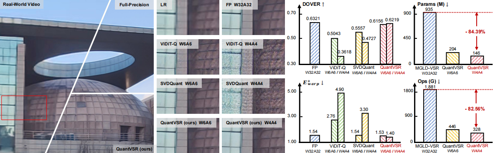
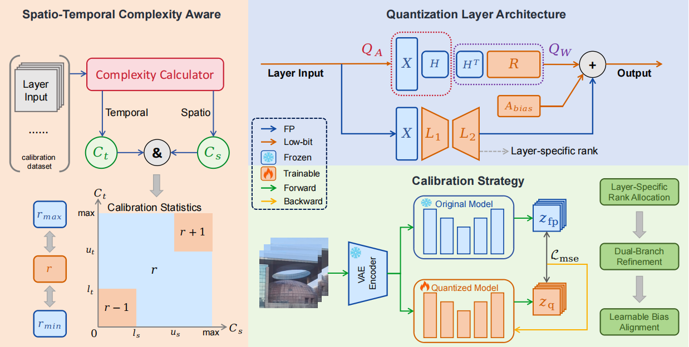
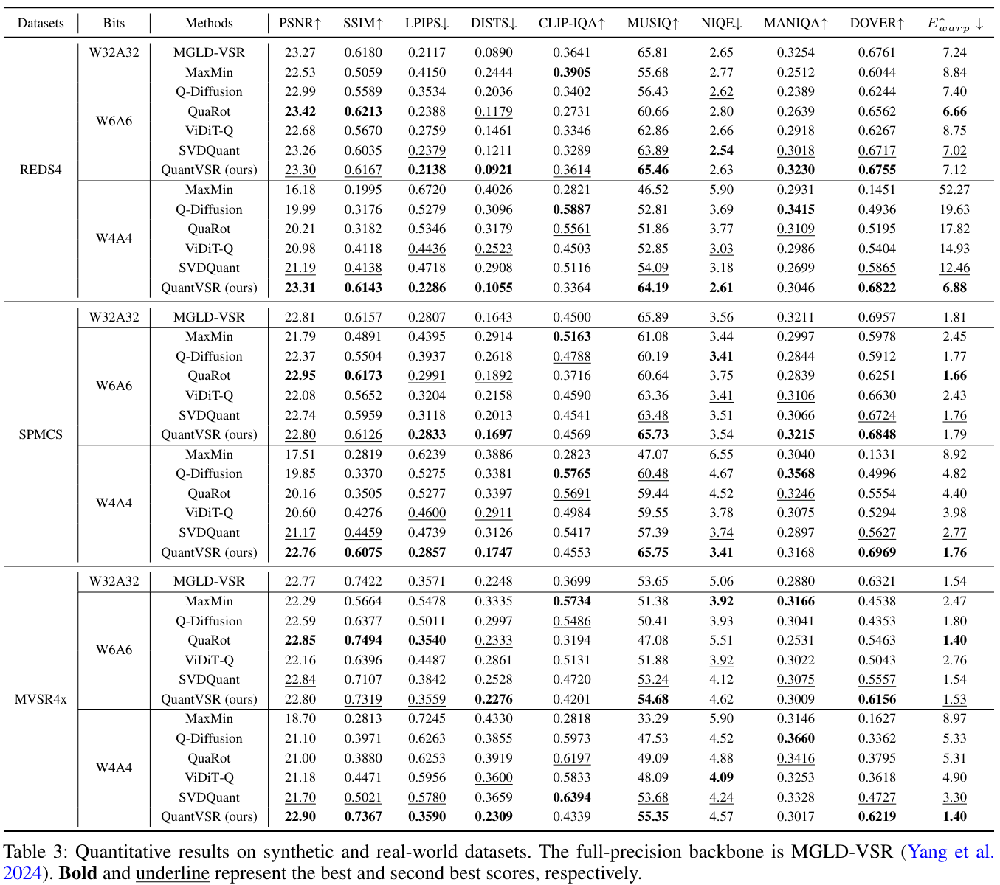
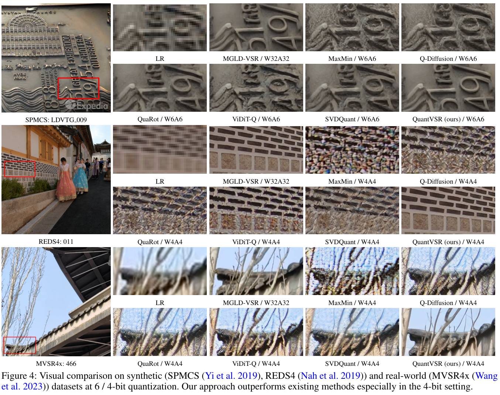

# QuantVSR: Low-Bit Post-Training Quantization for Real-World Video Super-Resolution

[Bowen Chai](https://github.com/bowenchai), [Zheng Chen](https://zhengchen1999.github.io/), [Libo Zhu](https://github.com/libozhu03), [Wenbo Li](https://fenglinglwb.github.io/), [Yong Guo](https://www.guoyongcs.com/), and [Yulun Zhang](http://yulunzhang.com/)

"QuantVSR: Low-Bit Post-Training Quantization for Real-World Video Super-Resolution", 2025

[project] [arXiv] [supplementary material] [dataset] [pretrained models]

#### 🔥🔥🔥 News

- **2025-08-06:** This repo is released.

---

> **Abstract:** Diffusion models have shown superior performance in real-world video super-resolution (VSR). However, the slow processing speeds and heavy resource consumption of diffusion models hinder their practical application and deployment. Quantization offers a potential solution for compressing the VSR model. Nevertheless, quantizing VSR models is challenging due to their temporal characteristics and high fidelity requirements. To address these issues, we propose QuantVSR, an effective low-bit quantization model for real-world VSR. We propose a spatio-temporal complexity aware (STCA) mechanism, where we first utilize the calibration dataset to measure both spatial and temporal complexities for each layer. Based on these statistics, we allocate layer-specific ranks to the low-rank full-precision (FP) auxiliary branch. Subsequently, we jointly refine the FP and low-bit branches to achieve simultaneous optimization. In addition, we propose a learnable bias alignment (LBA) module to reduce the biased quantization errors. Extensive experiments on synthetic and real-world datasets demonstrate that our method obtains comparable performance with the FP model and significantly outperforms recent leading low-bit quantization methods.

---

### Structure Overview

## 🔖 TODO

- [ ] Release testing code.
- [ ] Release pretrained models.
- [ ] Release calibration code.

## 🔗 Contents

1. Datasets
1. Models
1. Calibration
1. Testing
1. [Results](#results)
1. [Acknowledgements](#acknowledgements)

## 🔎 Results

QuantVSR significantly outperforms previous methods at the setting of W6A6 and W4A4.

Evaluation on synthetic and real-world datasets

Quantitative Results (click to expand)

- Results in Tab. 3 of the main paper

  

Qualitative Results (click to expand)

- Results in Fig. 4 of the main paper

  

## 💡 Acknowledgements

This project is based on [MGLD-VSR](https://github.com/IanYeung/MGLD-VSR).
